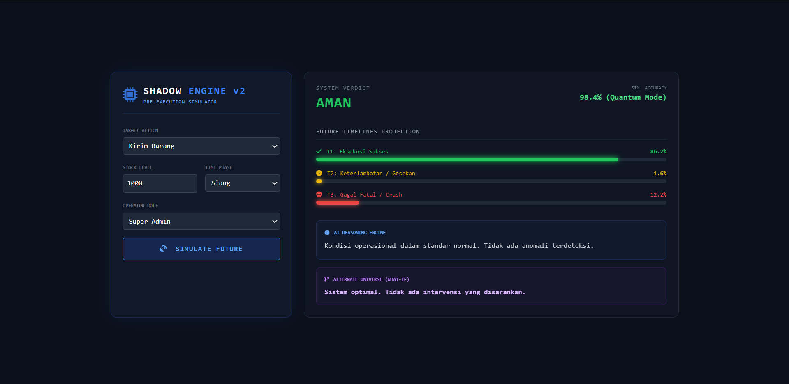
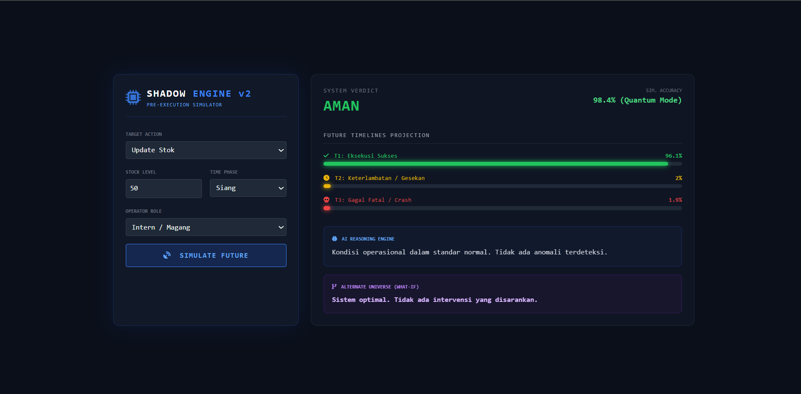
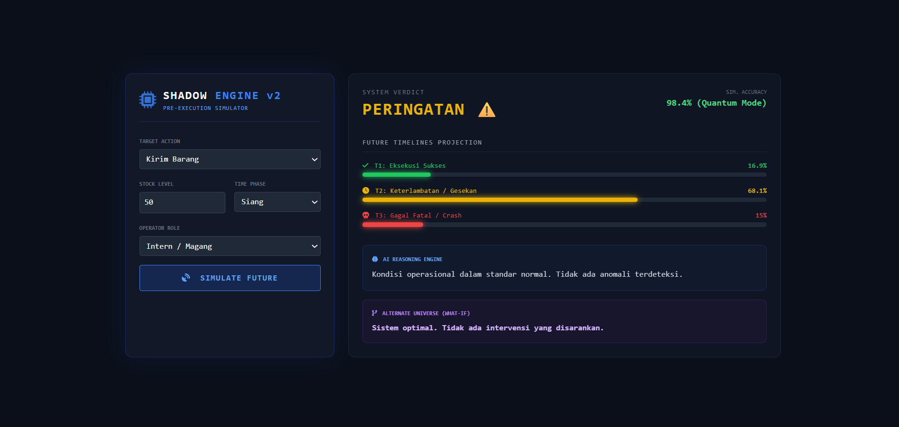

# 🚀 AI Shadow Operator v2

### *Pre-Execution Decision Intelligence System*

> ⚡ “Most AI systems analyze the past.
> We simulate the future.”

---

## 🧠 Overview

**AI Shadow Operator v2** adalah sistem berbasis Artificial Intelligence yang mampu **memprediksi dan mencegah kesalahan operasional sebelum terjadi**.

Berbeda dengan sistem AI konvensional yang hanya bersifat reaktif (setelah kejadian), sistem ini bekerja secara **proaktif** dengan mensimulasikan berbagai kemungkinan hasil dari suatu tindakan.

---

## 🔥 Key Features

### 🔮 Future Simulation Engine

Mensimulasikan hasil keputusan sebelum dieksekusi:

* ✅ Success (Berhasil)
* ⚠️ Delay (Keterlambatan)
* ❌ Failure (Gagal Fatal)

---

### 🧠 AI Reasoning Engine

Memberikan penjelasan berbasis data:

> Mengapa suatu keputusan berisiko tinggi?

---

### 🧬 Behavior-Aware Intelligence

Menganalisis pola kesalahan berdasarkan:

* Role (Admin / Staff / Intern)
* Waktu (Pagi / Siang / Malam)

---

### 🔁 What-If Scenario Simulator

Mensimulasikan alternatif keputusan:

> “Apa yang terjadi jika kondisi diubah?”

---

### 📊 Risk Scoring System

Memberikan tingkat risiko:

* 🟢 AMAN
* 🟡 PERINGATAN
* 🔴 BAHAYA FATAL

---

## 🖥️ Demo Preview

> Jalankan simulasi dan lihat bagaimana AI memprediksi masa depan sebelum keputusan diambil.

### 🧪 Example:

* Input: Kirim barang + stok rendah + malam
* Output: ❌ Risiko tinggi + rekomendasi solusi

---

## ⚙️ Tech Stack

| Layer           | Technology                   |
| --------------- | ---------------------------- |
| Backend         | FastAPI                      |
| AI Model        | Scikit-learn (Random Forest) |
| Data Processing | Pandas, NumPy                |
| Model Storage   | Joblib                       |
| Frontend        | HTML + TailwindCSS           |
| Integration     | JavaScript (Fetch API)       |

---

## 📁 Project Structure

```
AI-Shadow-Operator/
│
├── api.py                # FastAPI backend
├── train_model.py        # Training model AI
├── shadow_model_v2.pkl   # Model AI
├── encoders_v2.pkl       # Encoder
├── index.html            # Frontend UI
├── requirements.txt      # Dependencies
└── README.md             # Documentation
```

---

## ⚙️ Installation

### 1. Clone Repository

```bash
git clone https://github.com/USERNAME/ai-shadow-operator.git
cd ai-shadow-operator
```

---

### 2. Install Dependencies

```bash
pip install -r requirements.txt
```

---

### 3. Train Model

```bash
python train_model.py
```

---

### 4. Run Backend

```bash
uvicorn api:app --reload
```

---

### 5. Open API Docs

```
http://127.0.0.1:8000/docs
```

---

### 6. Run Frontend

Buka file:

```
index.html
```

---

## 🔌 API Endpoint

### POST `/simulate`

#### Parameters:

* `action`
* `stock`
* `price`
* `time`
* `user_role`

---

### 📤 Response Example

```json
{
  "risk_level": "BAHAYA FATAL ❌",
  "probabilities": {
    "success": 12.5,
    "delay": 30.2,
    "fail": 57.3
  },
  "insight": "Stok rendah dan waktu malam meningkatkan risiko kegagalan.",
  "what_if": "Jika stok ditingkatkan menjadi 150, risiko turun drastis."
}
```

---

## 🧪 Use Cases

### 🏭 Manufacturing

* Mencegah kesalahan operator mesin
* Mengurangi downtime produksi

### 🚚 Logistics

* Prediksi kegagalan pengiriman
* Optimasi distribusi barang

### 💰 Finance

* Mencegah kesalahan transaksi
* Risk decision support

### 🏪 UMKM

* Pengambilan keputusan bisnis berbasis AI

---

## 💡 Innovation

🔹 AI yang berpikir sebelum manusia bertindak
🔹 Simulasi masa depan berbasis data
🔹 Behavior-aware intelligence
🔹 Decision intelligence system

---

## 🚀 Future Development

* Integrasi IoT sensor real-time
* Computer Vision untuk monitoring langsung
* Deployment cloud (Azure / AWS)
* Integrasi LLM (AI conversational reasoning)

---

## 🏆 Why This Matters

Sebagian besar AI saat ini hanya memberikan insight setelah kejadian terjadi.

> Sistem ini mengubah paradigma menjadi:
> **“Predict → Simulate → Prevent”**

---

## 👨‍💻 Author

Developed for AI Impact Challenge 🚀

---

## ⭐ Support

Jika project ini menarik:

* ⭐ Star repo ini
* 🍴 Fork & develop lebih lanjut

---

## 🔥 Final Statement

> “The best way to fix a mistake is to prevent it before it happens.”


## 🖼️ Preview




